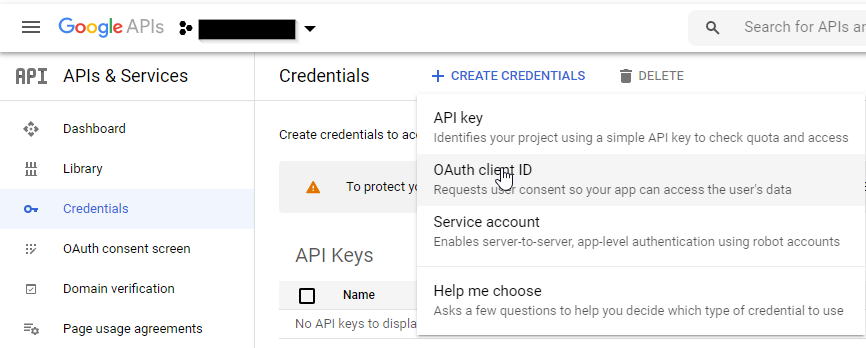
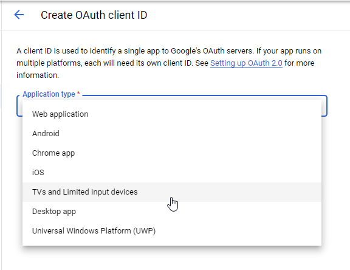
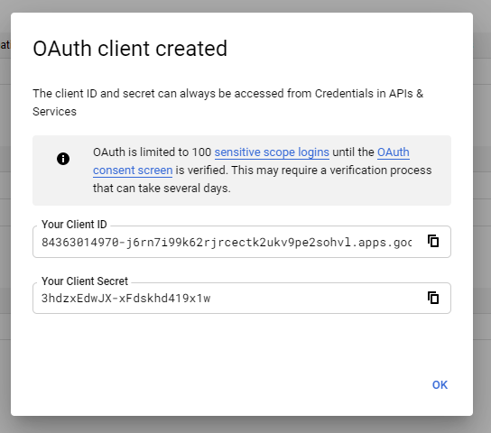
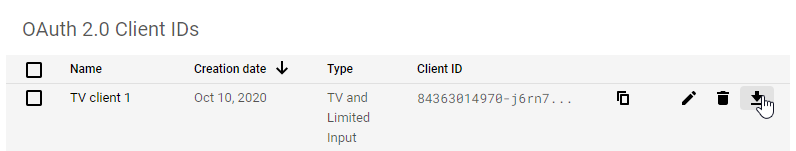

# Google Calendar API Nodes for Node-RED
This package contains nodes for accessing googles calendar API (using googleapis npm package).

# Setup Google Calendar API connection
1. Add one of the nodes you want to use to your flow.
2. Double-click the new node so that configuration page opens.
3. In the "Credentials"-combo box, select "Add new ... config" and click on the pen icon.
4. After giving a readable name, you are asked to insert your api client information. To retrieve it, go to [Google Developer Console](https://console.developers.google.com/) select (or create) your project.
5. Then go to "Credentials" and add a new OAuth Client-ID.

6. Select __TVs and Limited Input devices__

7. After creation you can see your Client-ID and Client-Key. You can copy those or hit OK and download them on the next screen.

8. Open the downloaded json file, copy the full content, press the "Import credentials.json" button and paste the copied content in the opened dialog. You should now see data in the "clientId", "clientSecret" and the "redirectUri" textboxes.
9. Now press the "Open Google Authentication" button and a new window of your browser will open. Follow the instructions and grant access to your project.
10. At the end of the authentication process, a google generated code will appear, which you must copy and paste into the code-text-box within the node configuration.
11. Press the "Enter Code"-button and you should see valid key data appear below.

## List upcoming events node
This node lists the next n upcoming events in the given calendar, starting from now.
#### Parameter "Num events"
This is the maximum number of events that will be listed.
#### Parameter "Maximum timespan in hours"
This is the maximum timespan, within which events will be listed. If you e.g. put 24, you will only get events which start within the next 24 hours.
#### Parameter "Refresh interval"
The node has an inbuilt refresh mechanism which cyclically pulls the upcoming events. Interval is customizable, if set to zero, no pulling will happen.

## List events on day node
This node can be used to list all events on one or multiple days. It also has an inbuilt
refresh mechanism which cyclically pulls the upcoming events. Interval is customizable, if set
to zero, no pulling will happen.
#### Parameter "Timezone offset"
Set this to your local timezone offset in reference to UTC (e.g. Berlin 2)
#### Parameter "Days offset start"
If set to zero (default), the earliest listet event starts at the current day at 0 AM. If set to greater than zero, the start of the interval in question starts earlier by the given number of days. For example, 1 would begin to list events from yesterday morning.
#### Parameter "Days offset end"
If set to zero (default), the latest listet event starts at the current day at 12 PM. If set to greater than zero, the start of the interval in question starts later by the given number of days. For example, 1 would end to list events at tomorrow night.
#### Parameter "Refresh interval"
The node has an inbuilt refresh mechanism which cyclically pulls the events. Interval is customizable, if set to zero, no pulling will happen.
